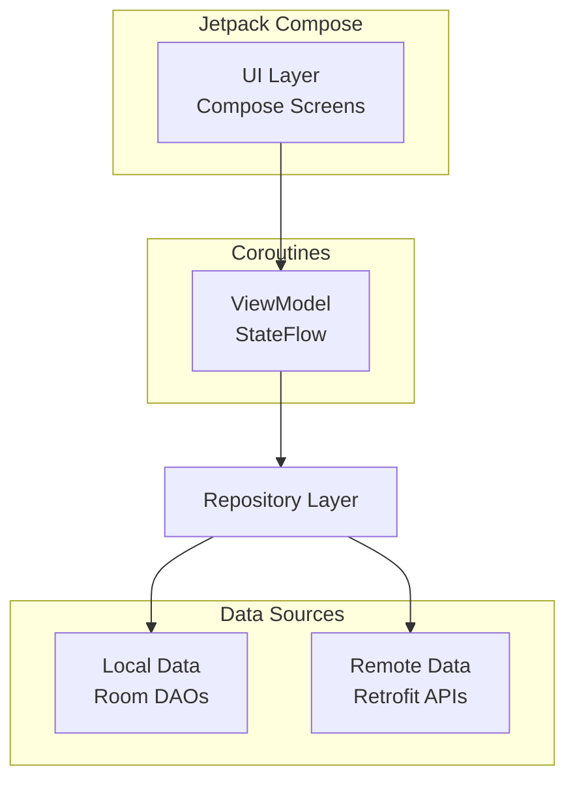
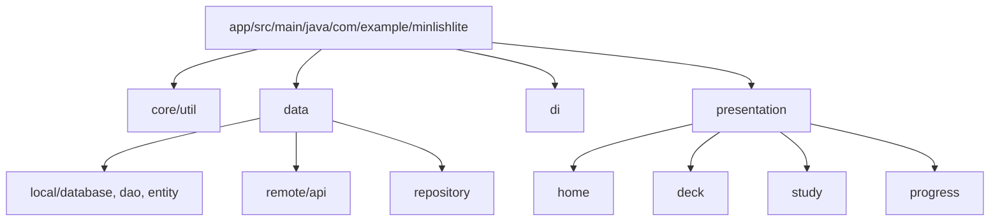
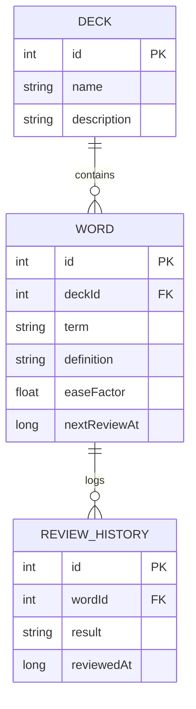
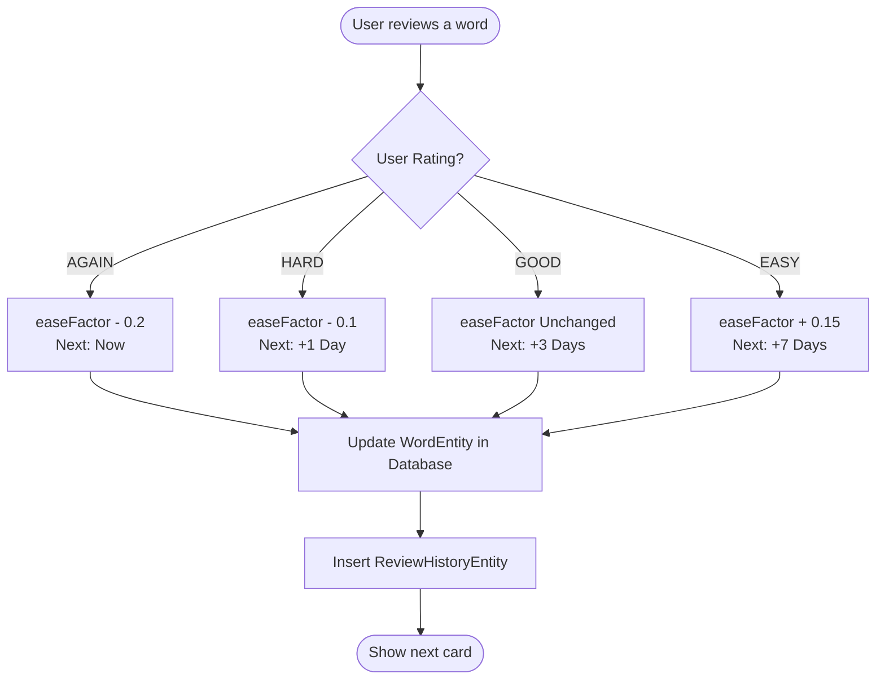

# Android Project Presentation Design

## 1. Project Analysis

### 1.1. Project Overview
- **Project Name:** MinLish Lite
- **Problem Solved:** Helps users learn English vocabulary effectively using a spaced repetition system (SRS).
- **Target Audience:** English learners who want to manage custom vocabulary decks and track their study progress.
- **Objectives:** Provide a lightweight, local-first application for vocabulary learning with dictionary integration and progress tracking.

### 1.2. Detected Technologies
- **Language:** Kotlin
- **UI Framework:** Jetpack Compose (Material 3)
- **Architecture:** MVVM (Model-View-ViewModel) with Repository Pattern
- **Local Database:** Room Database
- **Network / API:** Retrofit & OkHttp (for dictionary API `dictionaryapi.dev` and translation API `mymemory.translated.net`)
- **Key-Value Storage:** DataStore Preferences
- **Asynchronous Programming:** Kotlin Coroutines & Flow
- **Background Processing:** WorkManager
- **Dependency Injection:** Manual DI via `AppContainer`
- **Testing:** JUnit, MockK, Turbine, Coroutines Test

### 1.3. Software Architecture
The application follows the recommended Android Architecture guidelines (MVVM):
- **UI Layer (Presentation):** Built with Jetpack Compose (`HomeScreen`, `DeckListScreen`, `StudyScreen`, etc.) and ViewModels (`HomeViewModel`, `DeckListViewModel`, `StudyViewModel`, etc.) to manage UI state.
- **Data Layer (Repository):** Repositories (`DeckRepository`, `WordRepository`, `StudyRepository`, `ProgressRepository`, `DictionaryRepository`) handle data operations and mediate between local and remote sources.
- **Data Source Layer:**
  - **Local:** Room database (DAOs and Entities like `DeckDao`, `WordDao`, `DeckEntity`, `WordEntity`).
  - **Remote:** Retrofit services (`DictionaryApiService`, `TranslationApiService`).

### 1.4. Main Features
1. **Deck Management:** Create, edit, delete, and list vocabulary decks. Includes CSV Import/Export support (`CsvHelper`).
2. **Word Management:** Add, edit, and delete words within decks. Dictionary integration to fetch meanings and translations automatically.
3. **Study / Flashcards:** Review words using a Spaced Repetition System (SRS). Includes deck-specific study and a global "Review Today" feature (`ReviewTodayScreen`).
4. **Progress & Analytics:** Track learning progress, streaks, accuracy, retention rate, and unlock achievements.
5. **Settings & Profile:** Manage application preferences, daily study goals (e.g., new words per day), notification reminders, and user profile information (`SettingsScreen`).
6. **Onboarding:** Initial setup to configure learning goals, user name, and English proficiency level (`OnboardingScreen`).

### 1.5. Main Data Models
- **DeckEntity:** Represents a vocabulary deck.
- **WordEntity:** Represents a word flashcard with SRS properties (`easeFactor`, `nextReviewAt`, `reviewCount`, `correctCount`).
- **ReviewHistoryEntity:** Logs every review session for analytics.
- **UserEntity:** Stores basic user profile information.

### 1.6. Navigation Flow
`Splash Screen` -> `Onboarding` -> `Home Screen`
From `Home Screen`:
- -> `Deck List` -> `Deck Detail` -> `Study Mode` or `Word Detail/Edit`
- -> `Progress & Analytics`
- -> `Settings`

### 1.7. Algorithms and Processing Logic
- **Spaced Repetition System (SRS):** `SrsCalculator` determines the `nextReviewAt` timestamp and adjusts the `easeFactor` based on the user's review result (Again, Hard, Good, Easy).
- **Progress Calculation:** `ProgressCalculator` computes the user's study streak, accuracy percentage, retention rate, and determines achievement unlocking based on `ReviewHistoryEntity` records.

### 1.8. Current Strengths
- Modern UI implementation with Jetpack Compose and Material 3.
- Robust local-first architecture with Room Database.
- Effective integration of a real Spaced Repetition algorithm.
- Comprehensive progress tracking and analytics.
- Clean MVVM architecture separating concerns effectively.

### 1.9. Current Limitations
- Manual Dependency Injection is used instead of a framework like Hilt or Koin.
- Limited remote sync capabilities (data is primarily stored locally).
- Relies on free, rate-limited public APIs for dictionary and translation features.

## 2. Presentation Strategy

### 2.1. Target Audience
Instructors, technical reviewers, and peers evaluating the Android development project.

### 2.2. Main Presentation Message
MinLish Lite is a modern, robust, and functional Android application that effectively utilizes Jetpack Compose, Room, and Coroutines to deliver a polished vocabulary learning experience powered by a Spaced Repetition System.

### 2.3. Recommended Slide Count
14 Slides

### 2.4. Recommended Presentation Duration
10 - 15 minutes

### 2.5. Visual Style
- **Style:** Modern, Minimal, Professional, Technology-oriented.
- **Consistency:** Uniform spacing, consistent typography, and clean layouts.

### 2.6. Color Palette
- **Primary:** `#2563EB` (Blue)
- **Dark background:** `#0F172A`
- **Light background:** `#F8FAFC`
- **Main text:** `#0F172A`
- **Secondary text:** `#64748B`
- **Success:** `#16A34A` (Green)
- **Error:** `#DC2626` (Red)

### 2.7. Typography
- **Title:** Inter or Poppins (Bold)
- **Body:** Inter or Roboto (Regular)
- **Code:** JetBrains Mono

### 2.8. Screenshot Guidelines
- Use high-quality screenshots from a physical device or emulator.
- Ensure sample data looks realistic (e.g., real English words and Vietnamese translations).
- Highlight key UI areas using subtle borders or overlays.

### 2.9. Page Number Guidelines
- Bottom right corner.
- Format: `01`, `02`, etc.
- Hidden on the cover slide.

## 3. Slide-by-Slide Design

### Slide 1 — Cover Slide
- **Section:** Introduction
- **Slide purpose:** Introduce the presentation and the project.
- **Main title:** MinLish Lite
- **Subtitle:** A Modern English Vocabulary Learning Application
- **Content:** Team Members / Presenter Name, Date.
- **Suggested visual:** App logo or a clean mockup of the Home Screen on a smartphone frame.
- **Screenshot required:** None (Use mockup/logo).
- **Diagram required:** None.
- **Layout:** Centered content with a prominent title.
- **Speaker notes:** "Welcome to the presentation of MinLish Lite, an Android application designed to make English vocabulary learning efficient through spaced repetition."
- **Page number:** None
- **Source files:** N/A

### Slide 2 — Project Overview & Objectives
- **Section:** Introduction
- **Slide purpose:** Explain the problem and the app's goals.
- **Main title:** Project Overview
- **Subtitle:** Why MinLish Lite?
- **Content:**
  - Target Audience: English learners.
  - Problem: Forgetting vocabulary over time.
  - Solution: A local-first app using Spaced Repetition System (SRS).
- **Suggested visual:** Bullet points with relevant icons (e.g., target, brain, mobile phone).
- **Screenshot required:** None.
- **Diagram required:** None.
- **Layout:** Split layout (Text on left, Icons/Graphics on right).
- **Speaker notes:** "Our main goal was to solve the 'forgetting curve' problem by building a lightweight, responsive app that schedules reviews based on user performance."
- **Page number:** 01
- **Source files:** N/A

### Slide 3 — Applied Technologies
- **Section:** Introduction
- **Slide purpose:** Showcase the modern Android tech stack used.
- **Main title:** Technologies & Frameworks
- **Subtitle:** Built with the Modern Android Toolkit
- **Content:**
  - Kotlin & Coroutines
  - Jetpack Compose (Material 3)
  - Room Database
  - Retrofit & OkHttp
  - DataStore Preferences
- **Suggested visual:** Grid of technology logos (Kotlin, Jetpack Compose, Room, Retrofit).
- **Screenshot required:** None.
- **Diagram required:** None.
- **Layout:** Grid layout for tech logos with short labels.
- **Speaker notes:** "We strictly followed modern Android development practices, building the entire UI with Jetpack Compose and handling data persistence with Room and DataStore."
- **Page number:** 02
- **Source files:** `build.gradle.kts`, `gradle/libs.versions.toml`

### Slide 4 — System Architecture (MVVM)
- **Section:** System Design
- **Slide purpose:** Explain the application architecture.
- **Main title:** System Architecture
- **Subtitle:** MVVM with Repository Pattern
- **Content:**
  - UI Layer: Compose Screens & ViewModels
  - Domain/Data Layer: Repositories
  - Data Sources: Room (Local) & Retrofit (Remote)
- **Suggested visual:** Architecture Diagram showing data flow.
- **Screenshot required:** None.
- **Diagram required:** Architecture Diagram.
- **Layout:** Large diagram in the center with brief explanatory bullet points at the bottom.
- **Speaker notes:** "The app uses MVVM. The UI observes state from ViewModels via StateFlow. ViewModels interact with Repositories, which abstract the data sources like our local Room database and remote dictionary APIs."
- **Page number:** 03
- **Source files:** `di/AppContainer.kt`, `presentation/home/HomeViewModel.kt`, `data/repository/WordRepository.kt`

### Slide 5 — Data Model
- **Section:** System Design
- **Slide purpose:** Illustrate the core database entities.
- **Main title:** Core Data Models
- **Subtitle:** Room Database Entities
- **Content:**
  - `DeckEntity`: Groups of vocabulary.
  - `WordEntity`: The flashcard data, including SRS properties (`easeFactor`, `nextReviewAt`).
  - `ReviewHistoryEntity`: Tracks study sessions for analytics.
- **Suggested visual:** Entity-Relationship Diagram (ERD).
- **Screenshot required:** None.
- **Diagram required:** ERD Diagram.
- **Layout:** Diagram on the left, brief descriptions on the right.
- **Speaker notes:** "Our database revolves around Decks and Words. Crucially, the WordEntity stores SRS state variables, while the ReviewHistoryEntity allows us to calculate progress and streaks."
- **Page number:** 04
- **Source files:** `data/local/entity/WordEntity.kt`, `data/local/entity/DeckEntity.kt`, `data/local/entity/ReviewHistoryEntity.kt`

### Slide 6 — Core Algorithm: Spaced Repetition
- **Section:** System Design
- **Slide purpose:** Detail the core logic powering the study feature.
- **Main title:** Processing Logic
- **Subtitle:** Spaced Repetition System (SRS)
- **Content:**
  - Adjusts `easeFactor` based on user feedback (Again, Hard, Good, Easy).
  - Calculates `nextReviewAt` to optimize memory retention.
  - Ensures words you struggle with appear more frequently.
- **Suggested visual:** Flowchart of the SRS decision process.
- **Screenshot required:** None.
- **Diagram required:** Algorithm Flowchart.
- **Layout:** Flowchart in the center.
- **Speaker notes:** "The heart of MinLish Lite is the SrsCalculator. When a user reviews a word, they rate its difficulty. The algorithm updates the ease factor and schedules the next review date accordingly."
- **Page number:** 05
- **Source files:** `core/util/SrsCalculator.kt`

### Slide 7 — Core Algorithm: Progress Tracking
- **Section:** System Design
- **Slide purpose:** Explain how user progress is analyzed.
- **Main title:** Processing Logic
- **Subtitle:** Progress & Analytics
- **Content:**
  - Calculates study streaks from review history.
  - Computes accuracy and retention percentages.
  - Evaluates user level and unlocks achievements.
- **Suggested visual:** A small code snippet of the streak calculation or a logic flow diagram.
- **Screenshot required:** None.
- **Diagram required:** None (Use a code snippet of `computeStreak` or bullet points).
- **Layout:** Bullet points with an optional highlighted code snippet.
- **Speaker notes:** "The ProgressCalculator aggregates data from the ReviewHistoryDao. It computes consecutive study days for streaks and evaluates overall retention accuracy to unlock user achievements."
- **Page number:** 06
- **Source files:** `core/util/ProgressCalculator.kt`

### Slide 8 — Product Demo: Home & Navigation
- **Section:** Product Demonstration
- **Slide purpose:** Show the main entry point of the app.
- **Main title:** Home & Dashboard
- **Subtitle:** User Overview
- **Content:**
  - Displays daily study reminders.
  - Provides quick access to decks and progress.
- **Suggested visual:** Screenshot of the Home Screen.
- **Screenshot required:** Home Screen (`HomeScreen`).
- **Diagram required:** None.
- **Layout:** Screenshot on the left, feature highlights on the right.
- **Speaker notes:** "This is the Home screen. It gives users an immediate overview of their daily tasks and quick navigation to their vocabulary decks and analytics."
- **Page number:** 07
- **Source files:** `presentation/home/HomeScreen.kt`

### Slide 9 — Product Demo: Deck Management
- **Section:** Product Demonstration
- **Slide purpose:** Show CRUD operations for decks and import/export capabilities.
- **Main title:** Deck Management
- **Subtitle:** Organize Your Vocabulary
- **Content:**
  - Create, edit, and delete custom decks.
  - Import and Export decks using CSV files.
  - View summary statistics for each deck.
- **Suggested visual:** Screenshots of Deck List and Add/Edit Deck screens.
- **Screenshot required:** Deck List Screen (`DeckListScreen`), Add/Edit Deck Dialog/Screen.
- **Diagram required:** None.
- **Layout:** Two screenshots side-by-side.
- **Speaker notes:** "Users can easily manage their collections of words by creating custom decks. The deck list shows a summary of words due for review."
- **Page number:** 08
- **Source files:** `presentation/deck/DeckListScreen.kt`, `presentation/deck/AddEditDeckScreen.kt`

### Slide 10 — Product Demo: Word Management & Dictionary
- **Section:** Product Demonstration
- **Slide purpose:** Show how words are added and fetched from APIs.
- **Main title:** Word Management
- **Subtitle:** Integrated Dictionary & Translation
- **Content:**
  - Add words manually or fetch meanings via the Dictionary API.
  - Automatic translation capabilities.
- **Suggested visual:** Screenshot of Deck Detail / Add Word screen showing dictionary results.
- **Screenshot required:** Deck Detail Screen (`DeckDetailScreen`) or Word Detail Screen.
- **Diagram required:** None.
- **Layout:** Screenshot on the left, API integration points on the right.
- **Speaker notes:** "To save time, users can fetch definitions and translations automatically. We integrate with public dictionary and translation APIs via Retrofit to populate flashcard data."
- **Page number:** 09
- **Source files:** `presentation/deck/DeckDetailScreen.kt`, `data/repository/DictionaryRepository.kt`

### Slide 11 — Product Demo: Study Mode (Flashcards)
- **Section:** Product Demonstration
- **Slide purpose:** Demonstrate the core study loop.
- **Main title:** Study Mode
- **Subtitle:** Active Recall & SRS
- **Content:**
  - "Review Today" feature for global daily due words.
  - Flashcard UI (Front/Back).
  - Self-assessment rating buttons (Again, Hard, Good, Easy).
- **Suggested visual:** Screenshots of the Study Screen (Front of card, Back of card with rating buttons).
- **Screenshot required:** Study Screen (`StudyScreen`, `Flashcard`, `ReviewRatingButtons`).
- **Diagram required:** None.
- **Layout:** Two screenshots (Before/After flipping the card).
- **Speaker notes:** "During study mode, users are presented with flashcards. After flipping the card to check their memory, they rate their recall. These ratings feed directly into our SRS algorithm."
- **Page number:** 10
- **Source files:** `presentation/study/StudyScreen.kt`, `presentation/study/Flashcard.kt`

### Slide 12 — Product Demo: Progress Analytics
- **Section:** Product Demonstration
- **Slide purpose:** Show user statistics and achievements.
- **Main title:** Progress Tracking
- **Subtitle:** Visualizing Success
- **Content:**
  - Weekly activity charts.
  - Streak counters and retention accuracy.
  - Unlockable achievements.
- **Suggested visual:** Screenshot of the Progress/Analytics Screen.
- **Screenshot required:** Progress Screen (if available in `presentation/progress`).
- **Diagram required:** None.
- **Layout:** Large screenshot on the left, metric descriptions on the right.
- **Speaker notes:** "To keep users motivated, the app tracks and visualizes their learning journey, showing current streaks, accuracy, and unlocking achievements based on their review history."
- **Page number:** 11
- **Source files:** `presentation/progress` (assuming existence based on `ProgressCalculator`), `data/model/ProgressAnalytics.kt`

### Slide 13 — Project Evaluation
- **Section:** Conclusion
- **Slide purpose:** Provide an honest assessment of the project.
- **Main title:** Self-Evaluation
- **Subtitle:** Strengths & Limitations
- **Content:**
  - **Strengths:** Clean architecture, effective SRS algorithm, smooth Jetpack Compose UI, robust Room integration.
  - **Limitations:** Manual DI scales poorly for larger apps; dependency on rate-limited public APIs; no cloud backup functionality yet.
- **Suggested visual:** Two-column list (Strengths vs. Limitations) with checkmarks and warning icons.
- **Screenshot required:** None.
- **Diagram required:** None.
- **Layout:** Split layout.
- **Speaker notes:** "Overall, the app successfully implements a robust local-first SRS experience. However, the manual dependency injection could be improved, and relying on public APIs introduces potential rate-limiting issues."
- **Page number:** 12
- **Source files:** N/A

### Slide 14 — Future Development & Q&A
- **Section:** Conclusion
- **Slide purpose:** Outline next steps and conclude the presentation.
- **Main title:** Future Development
- **Subtitle:** What's Next for MinLish Lite?
- **Content:**
  - **Short-term:** Migrate to Hilt for Dependency Injection; add comprehensive unit tests for UI layer.
  - **Long-term:** Implement Firebase for cross-device cloud synchronization; add support for multimedia flashcards (images/audio).
  - **Thank You / Q&A**
- **Suggested visual:** A subtle background image or clean text layout ending with a Q&A prompt.
- **Screenshot required:** None.
- **Diagram required:** None.
- **Layout:** Bullet points ending with a large "Thank You" or "Q&A".
- **Speaker notes:** "In the future, we plan to migrate to Hilt and add cloud sync via Firebase. Thank you for listening. I am now open to any questions."
- **Page number:** 13
- **Source files:** N/A

## 4. Required Diagrams

### 4.1. Architecture Diagram

*Note: This diagram illustrates the MVVM data flow from the UI layer down to local and remote data sources. Best placed on Slide 4.*

### 4.2. Folder Structure Diagram

*Note: Highlights the clean modularization by feature and architectural layer. Can be used as supplementary material on Slide 4.*

### 4.3. Data Model (ERD)

*Note: Shows the relationship between the main Room Database entities. Best placed on Slide 5.*

### 4.4. Algorithm Flowchart (SRS)

*Note: Explains the logic inside `SrsCalculator.kt` and `StudyRepository.kt`. Best placed on Slide 6.*

## 5. Screenshot Checklist

- [ ] **Home Screen Mockup**
  - **Related slide:** Slide 1
  - **Screen:** `HomeScreen`
  - **Required state:** Clean display with app title.
  - **Test data:** N/A
  - **Elements to highlight:** App branding.
  - **Recommended crop:** Device frame.
  - **Caption:** MinLish Lite Application

- [ ] **Home Screen Dashboard**
  - **Related slide:** Slide 8
  - **Screen:** `HomeScreen`
  - **Required state:** Showing a study reminder and quick stats.
  - **Test data:** 2 decks created, some words due today.
  - **Elements to highlight:** StudyReminderBanner.
  - **Recommended crop:** Full screen.
  - **Caption:** The main dashboard showing daily goals.

- [ ] **Deck List**
  - **Related slide:** Slide 9
  - **Screen:** `DeckListScreen`
  - **Required state:** List of 2-3 decks with word counts.
  - **Test data:** "Basic English", "Tech Vocabulary".
  - **Elements to highlight:** Floating Action Button (FAB) for adding decks.
  - **Recommended crop:** Full screen.
  - **Caption:** Managing vocabulary collections.

- [ ] **Word Management with Dictionary**
  - **Related slide:** Slide 10
  - **Screen:** `DeckDetailScreen` / Add Word Dialog
  - **Required state:** Showing a fetched definition/translation for a word.
  - **Test data:** Word: "Ephemeral", with fetched definition.
  - **Elements to highlight:** Dictionary API result area.
  - **Recommended crop:** Center dialog/screen.
  - **Caption:** Automatic translation and definition fetching.

- [ ] **Study Mode - Flashcard Front**
  - **Related slide:** Slide 11
  - **Screen:** `StudyScreen`
  - **Required state:** Showing the term only.
  - **Test data:** Term: "Ubiquitous".
  - **Elements to highlight:** The main flashcard card.
  - **Recommended crop:** Full screen.
  - **Caption:** Active recall testing.

- [ ] **Study Mode - Rating Options**
  - **Related slide:** Slide 11
  - **Screen:** `StudyScreen`
  - **Required state:** Card is flipped, showing definition and 4 rating buttons.
  - **Test data:** Term with definition shown.
  - **Elements to highlight:** `ReviewRatingButtons` (Again, Hard, Good, Easy).
  - **Recommended crop:** Bottom half of the screen.
  - **Caption:** SRS self-assessment.

- [ ] **Progress Analytics**
  - **Related slide:** Slide 12
  - **Screen:** Progress/Analytics Screen
  - **Required state:** Showing streak, accuracy, and achievements.
  - **Test data:** 7-day streak, 85% accuracy.
  - **Elements to highlight:** Charts or stat cards.
  - **Recommended crop:** Full screen.
  - **Caption:** Tracking user learning progress.

## 6. Presentation Content Validation

| Presentation claim | Evidence in source code | File path | Confidence |
| :--- | :--- | :--- | :--- |
| Built with Jetpack Compose | Dependencies in `build.gradle.kts` and UI files | `app/build.gradle.kts`, `presentation/.../*.kt` | High |
| MVVM Architecture | Usage of ViewModels and Repositories | `presentation/home/HomeViewModel.kt`, `data/repository/...` | High |
| Room Database Integration | DAOs and Entities definitions | `data/local/database/AppDatabase.kt`, `data/local/dao/*.kt` | High |
| Spaced Repetition Logic | `SrsCalculator` object logic | `core/util/SrsCalculator.kt` | High |
| Progress Calculation | `ProgressCalculator` analytics logic | `core/util/ProgressCalculator.kt` | High |
| Remote API Integration | Retrofit setup and API service usage | `di/AppContainer.kt`, `data/repository/DictionaryRepository.kt` | High |
| Manual Dependency Injection | `AppContainer` and `AppDataContainer` | `di/AppContainer.kt` | High |

## 7. Final Review Checklist

### Content
- [x] All slides are based on the actual project.
- [x] No unsupported feature is mentioned.
- [x] All main functions are introduced.
- [x] Architecture description matches the source code.
- [x] Technologies are verified from dependencies and implementation.
- [x] Algorithms are not fabricated.
- [x] Strengths and limitations are evaluated honestly.
- [x] Future improvements are realistic.

### Language
- [x] English grammar has been checked.
- [x] Spelling has been checked.
- [x] Technical terms are used consistently.
- [x] Slide text is concise.
- [x] Speaker notes are clear and natural.

### Visual Design
- [x] The visual style is consistent.
- [x] Every slide has a clear visual hierarchy.
- [x] Screenshots are readable.
- [x] Diagrams are not overcrowded.
- [x] Font sizes are presentation-friendly.
- [x] Page numbers are consistent.
- [x] No slide contains excessive text.

### Presentation Readiness
- [ ] All screenshots have been prepared (Pending manual generation).
- [x] All diagrams have been reviewed.
- [x] Demo data is realistic.
- [x] Slide order follows a logical story.
- [x] The presentation fits the recommended duration.
- [x] The final slide includes “Thank You” or “Questions and Answers”.
