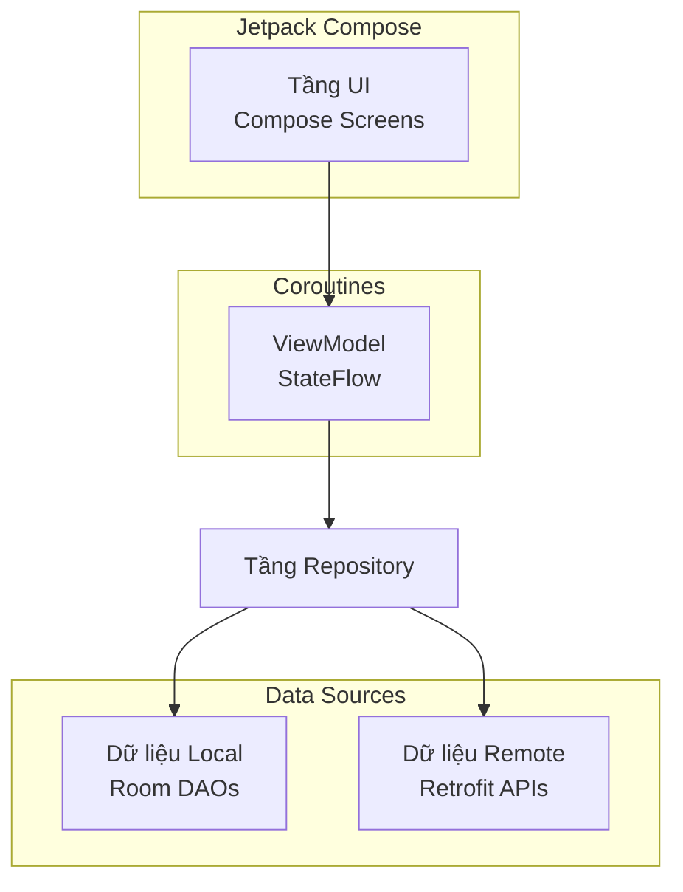
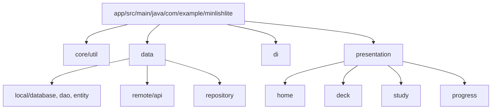
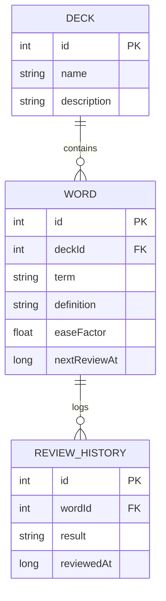

# Thiết Kế Bài Thuyết Trình Dự Án Android

## 1. Phân Tích Dự Án

### 1.1. Tổng Quan Dự Án
- **Tên dự án:** MinLish Lite
- **Bài toán giải quyết:** Giúp người dùng học từ vựng tiếng Anh hiệu quả bằng cách sử dụng hệ thống lặp lại ngắt quãng (Spaced Repetition System - SRS).
- **Đối tượng sử dụng:** Người học tiếng Anh muốn quản lý các bộ từ vựng cá nhân và theo dõi tiến độ học tập.
- **Mục tiêu:** Cung cấp một ứng dụng gọn nhẹ, hoạt động chủ yếu ngoại tuyến (local-first) để học từ vựng với tính năng tích hợp tra từ điển và theo dõi tiến độ.

### 1.2. Các Công Nghệ Phát Hiện Được
- **Ngôn ngữ:** Kotlin
- **UI Framework:** Jetpack Compose (Material 3)
- **Kiến trúc:** MVVM (Model-View-ViewModel) kết hợp Repository Pattern
- **Cơ sở dữ liệu cục bộ (Local Database):** Room Database
- **Mạng / API:** Retrofit & OkHttp (dành cho API từ điển `dictionaryapi.dev` và API dịch thuật `mymemory.translated.net`)
- **Lưu trữ Key-Value:** DataStore Preferences
- **Lập trình bất đồng bộ:** Kotlin Coroutines & Flow
- **Xử lý nền:** WorkManager
- **Dependency Injection:** DI thủ công qua `AppContainer`
- **Testing:** JUnit, MockK, Turbine, Coroutines Test

### 1.3. Kiến Trúc Phần Mềm
Ứng dụng tuân theo các hướng dẫn Kiến trúc Android hiện đại (MVVM):
- **Tầng Giao Diện (UI Layer - Presentation):** Xây dựng bằng Jetpack Compose (`HomeScreen`, `DeckListScreen`, `StudyScreen`, v.v.) và các ViewModels (`HomeViewModel`, `DeckListViewModel`, `StudyViewModel`, v.v.) để quản lý trạng thái UI.
- **Tầng Dữ Liệu (Data Layer - Repository):** Các Repositories (`DeckRepository`, `WordRepository`, `StudyRepository`, `ProgressRepository`, `DictionaryRepository`) xử lý các thao tác dữ liệu và làm trung gian giữa nguồn dữ liệu cục bộ và từ xa.
- **Tầng Nguồn Dữ Liệu (Data Source Layer):**
  - **Local:** CSDL Room (các DAOs và Entities như `DeckDao`, `WordDao`, `DeckEntity`, `WordEntity`).
  - **Remote:** Dịch vụ Retrofit (`DictionaryApiService`, `TranslationApiService`).

### 1.4. Chức Năng Chính
1. **Quản lý Bộ từ (Deck Management):** Tạo, sửa, xóa và liệt kê các bộ từ vựng. Hỗ trợ Nhập/Xuất file CSV (`CsvHelper`).
2. **Quản lý Từ vựng (Word Management):** Thêm, sửa, xóa từ vựng trong bộ từ. Tích hợp từ điển để tự động lấy ý nghĩa và bản dịch.
3. **Học / Flashcards (Study):** Ôn tập từ vựng sử dụng Hệ thống lặp lại ngắt quãng (SRS). Cung cấp chế độ học theo từng bộ từ và tính năng "Ôn tập hôm nay" (Review Today) cho toàn bộ từ đến hạn.
4. **Tiến độ & Phân tích (Progress & Analytics):** Theo dõi tiến độ học, chuỗi ngày học (streak), độ chính xác, tỷ lệ ghi nhớ và mở khóa thành tựu.
5. **Cài đặt & Hồ sơ (Settings & Profile):** Quản lý các tùy chọn ứng dụng, mục tiêu học tập (số từ mới mỗi ngày), thông báo nhắc nhở và thông tin hồ sơ cá nhân (`SettingsScreen`).
#6. **Hướng dẫn người mới (Onboarding):** Thiết lập ban đầu để cấu hình mục tiêu học tập, tên người dùng và trình độ tiếng Anh (`OnboardingScreen`).

### 1.5. Mô Hình Dữ Liệu Chính
- **DeckEntity:** Đại diện cho một bộ từ vựng.
- **WordEntity:** Đại diện cho một thẻ flashcard từ vựng kèm theo các thuộc tính SRS (`easeFactor`, `nextReviewAt`, `reviewCount`, `correctCount`).
- **ReviewHistoryEntity:** Lưu lại lịch sử mỗi phiên ôn tập để phục vụ cho việc phân tích dữ liệu.
- **UserEntity:** Lưu trữ thông tin hồ sơ cơ bản của người dùng.

### 1.6. Luồng Điều Hướng
`Màn hình Splash` -> `Onboarding` -> `Màn hình Home`
Từ `Màn hình Home`:
- -> `Danh sách Bộ từ (Deck List)` -> `Chi tiết Bộ từ (Deck Detail)` -> `Chế độ Học (Study Mode)` hoặc `Chi tiết/Sửa Từ vựng`
- -> `Tiến độ & Phân tích (Progress & Analytics)`
- -> `Cài đặt (Settings)`

### 1.7. Thuật Toán Và Logic Xử Lý
- **Hệ Thống Lặp Lại Ngắt Quãng (SRS):** `SrsCalculator` tính toán thời điểm ôn tập tiếp theo (`nextReviewAt`) và điều chỉnh hệ số độ dễ (`easeFactor`) dựa trên kết quả tự đánh giá của người dùng (Again, Hard, Good, Easy).
- **Tính Toán Tiến Độ:** `ProgressCalculator` tính chuỗi ngày học (streak), tỷ lệ chính xác, tỷ lệ ghi nhớ và xác định việc mở khóa thành tựu dựa trên dữ liệu từ `ReviewHistoryEntity`.

### 1.8. Điểm Mạnh Hiện Tại
- Triển khai giao diện người dùng hiện đại với Jetpack Compose và Material 3.
- Kiến trúc ưu tiên dữ liệu cục bộ (local-first) mạnh mẽ với Room Database.
- Tích hợp hiệu quả thuật toán Lặp lại ngắt quãng (Spaced Repetition) thực tế.
- Hệ thống theo dõi tiến độ và phân tích dữ liệu học tập toàn diện.
- Kiến trúc MVVM phân tách rõ ràng các tầng logic.

### 1.9. Hạn Chế Hiện Tại
- Sử dụng Dependency Injection thủ công thay vì dùng các framework chuẩn như Hilt hay Koin.
- Khả năng đồng bộ hóa dữ liệu trên đám mây còn hạn chế (dữ liệu chủ yếu lưu ở máy).
- Phụ thuộc vào các API từ điển và dịch thuật công cộng, miễn phí nhưng bị giới hạn lượt gọi (rate-limited).

## 2. Chiến Lược Thuyết Trình

### 2.1. Đối Tượng Nghe
Giảng viên, người đánh giá kỹ thuật và đồng nghiệp đánh giá dự án phát triển Android.

### 2.2. Thông Điệp Chính
MinLish Lite là một ứng dụng Android hiện đại, mạnh mẽ và đầy đủ chức năng. Dự án tận dụng hiệu quả Jetpack Compose, Room và Coroutines để mang lại trải nghiệm học từ vựng chỉn chu, được hỗ trợ bởi Hệ thống lặp lại ngắt quãng (SRS).

### 2.3. Số Lượng Slide Đề Xuất
14 Slides

### 2.4. Thời Lượng Thuyết Trình Đề Xuất
10 - 15 phút

### 2.5. Phong Cách Hình Ảnh
- **Phong cách:** Hiện đại, Tối giản, Chuyên nghiệp, Hướng công nghệ.
- **Sự nhất quán:** Khoảng cách đồng đều, kiểu chữ nhất quán và bố cục gọn gàng.

### 2.6. Bảng Màu
- **Màu chính (Primary):** `#2563EB` (Xanh dương)
- **Nền tối:** `#0F172A`
- **Nền sáng:** `#F8FAFC`
- **Chữ chính:** `#0F172A`
- **Chữ phụ:** `#64748B`
- **Thành công:** `#16A34A` (Xanh lá)
- **Lỗi:** `#DC2626` (Đỏ)

### 2.7. Kiểu Chữ (Typography)
- **Tiêu đề:** Inter hoặc Poppins (In đậm)
- **Thân bài:** Inter hoặc Roboto (Bình thường)
- **Code:** JetBrains Mono

### 2.8. Hướng Dẫn Chụp Ảnh Màn Hình (Screenshot)
- Sử dụng ảnh chụp màn hình chất lượng cao từ thiết bị thật hoặc máy ảo (emulator).
- Đảm bảo dữ liệu mẫu trông thực tế (ví dụ: các từ tiếng Anh thực và bản dịch tiếng Việt).
- Làm nổi bật các khu vực giao diện quan trọng bằng viền hoặc lớp phủ mờ.

### 2.9. Hướng Dẫn Đánh Số Trang
- Nằm ở góc dưới cùng bên phải.
- Định dạng: `01`, `02`, v.v.
- Không hiển thị trên slide bìa.

## 3. Thiết Kế Từng Slide

### Slide 1 — Slide Bìa (Cover)
- **Phần:** Introduction
- **Mục đích slide:** Giới thiệu bài thuyết trình và dự án.
- **Tiêu đề chính:** MinLish Lite
- **Tiêu đề phụ:** Ứng Dụng Học Từ Vựng Tiếng Anh Hiện Đại
- **Nội dung:** Tên nhóm / Người trình bày, Ngày tháng.
- **Hình ảnh đề xuất:** Logo ứng dụng hoặc một mockup (mô hình) gọn gàng của màn hình Home trên khung điện thoại smartphone.
- **Ảnh màn hình cần có:** Không (Dùng mockup/logo).
- **Sơ đồ cần có:** Không.
- **Bố cục:** Căn giữa nội dung với tiêu đề nổi bật.
- **Speaker notes (Ghi chú nói):** "Chào mừng quý vị đến với bài thuyết trình về MinLish Lite, một ứng dụng Android được thiết kế để giúp việc học từ vựng tiếng Anh trở nên hiệu quả thông qua phương pháp lặp lại ngắt quãng."
- **Số trang:** Không có
- **File nguồn:** N/A

### Slide 2 — Tổng Quan & Mục Tiêu Dự Án
- **Phần:** Introduction
- **Mục đích slide:** Giải thích bài toán và mục tiêu của ứng dụng.
- **Tiêu đề chính:** Tổng Quan Dự Án
- **Tiêu đề phụ:** Tại sao lại chọn MinLish Lite?
- **Nội dung:**
  - Đối tượng: Người học tiếng Anh.
  - Vấn đề: Quên từ vựng theo thời gian (Đường cong lãng quên).
  - Giải pháp: Ứng dụng local-first dùng Hệ Thống Lặp Lại Ngắt Quãng (SRS).
- **Hình ảnh đề xuất:** Các điểm bullet kèm icon liên quan (ví dụ: mục tiêu, bộ não, điện thoại).
- **Ảnh màn hình cần có:** Không.
- **Sơ đồ cần có:** Không.
- **Bố cục:** Bố cục chia đôi (Chữ bên trái, Icon/Hình ảnh bên phải).
- **Speaker notes:** "Mục tiêu chính của chúng tôi là giải quyết vấn đề 'đường cong lãng quên' bằng cách xây dựng một ứng dụng nhẹ, phản hồi nhanh, có chức năng lên lịch ôn tập dựa trên hiệu suất của người dùng."
- **Số trang:** 01
- **File nguồn:** N/A

### Slide 3 — Công Nghệ Sử Dụng
- **Phần:** Introduction
- **Mục đích slide:** Thể hiện bộ công cụ công nghệ Android hiện đại được áp dụng.
- **Tiêu đề chính:** Công Nghệ & Framework
- **Tiêu đề phụ:** Xây Dựng Bằng Bộ Công Cụ Android Hiện Đại
- **Nội dung:**
  - Kotlin & Coroutines
  - Jetpack Compose (Material 3)
  - Room Database
  - Retrofit & OkHttp
  - DataStore Preferences
- **Hình ảnh đề xuất:** Lưới các logo công nghệ (Kotlin, Jetpack Compose, Room, Retrofit).
- **Ảnh màn hình cần có:** Không.
- **Sơ đồ cần có:** Không.
- **Bố cục:** Bố cục dạng lưới (Grid) cho logo kèm nhãn ngắn.
- **Speaker notes:** "Chúng tôi tuân thủ nghiêm ngặt các phương pháp phát triển Android hiện đại, xây dựng toàn bộ giao diện với Jetpack Compose và xử lý lưu trữ dữ liệu bằng Room và DataStore."
- **Số trang:** 02
- **File nguồn:** `build.gradle.kts`, `gradle/libs.versions.toml`

### Slide 4 — Kiến Trúc Hệ Thống (MVVM)
- **Phần:** System Design
- **Mục đích slide:** Giải thích kiến trúc của ứng dụng.
- **Tiêu đề chính:** Kiến Trúc Hệ Thống
- **Tiêu đề phụ:** MVVM Kết Hợp Repository Pattern
- **Nội dung:**
  - Tầng UI: Các màn hình Compose & ViewModels
  - Tầng Domain/Data: Các Repositories
  - Nguồn dữ liệu: Room (Local) & Retrofit (Remote)
- **Hình ảnh đề xuất:** Sơ đồ kiến trúc thể hiện luồng dữ liệu.
- **Ảnh màn hình cần có:** Không.
- **Sơ đồ cần có:** Sơ đồ kiến trúc (Architecture Diagram).
- **Bố cục:** Sơ đồ lớn ở giữa với các điểm giải thích ngắn ở dưới.
- **Speaker notes:** "Ứng dụng sử dụng kiến trúc MVVM. Tầng UI quan sát trạng thái từ ViewModels qua StateFlow. ViewModels tương tác với các Repositories, đóng vai trò trừu tượng hóa các nguồn dữ liệu như CSDL Room cục bộ và các API từ điển từ xa."
- **Số trang:** 03
- **File nguồn:** `di/AppContainer.kt`, `presentation/home/HomeViewModel.kt`, `data/repository/WordRepository.kt`

### Slide 5 — Mô Hình Dữ Liệu
- **Phần:** System Design
- **Mục đích slide:** Minh họa các bảng dữ liệu (entity) cốt lõi trong database.
- **Tiêu đề chính:** Mô Hình Dữ Liệu Cốt Lõi
- **Tiêu đề phụ:** Room Database Entities
- **Nội dung:**
  - `DeckEntity`: Nhóm từ vựng (bộ từ).
  - `WordEntity`: Dữ liệu flashcard, bao gồm các thuộc tính SRS (`easeFactor`, `nextReviewAt`).
  - `ReviewHistoryEntity`: Theo dõi các phiên học để phục vụ phân tích.
- **Hình ảnh đề xuất:** Sơ đồ quan hệ thực thể (ERD).
- **Ảnh màn hình cần có:** Không.
- **Sơ đồ cần có:** Sơ đồ ERD.
- **Bố cục:** Sơ đồ bên trái, mô tả ngắn gọn bên phải.
- **Speaker notes:** "Cơ sở dữ liệu của chúng tôi xoay quanh các Deck (Bộ từ) và Word (Từ vựng). Điểm quan trọng là WordEntity lưu các biến trạng thái SRS, trong khi ReviewHistoryEntity giúp chúng tôi tính toán tiến trình và chuỗi ngày học."
- **Số trang:** 04
- **File nguồn:** `data/local/entity/WordEntity.kt`, `data/local/entity/DeckEntity.kt`, `data/local/entity/ReviewHistoryEntity.kt`

### Slide 6 — Thuật Toán Lõi: Spaced Repetition (Lặp Lại Ngắt Quãng)
- **Phần:** System Design
- **Mục đích slide:** Chi tiết hóa logic cốt lõi vận hành tính năng học tập.
- **Tiêu đề chính:** Logic Xử Lý
- **Tiêu đề phụ:** Hệ Thống Lặp Lại Ngắt Quãng (SRS)
- **Nội dung:**
  - Điều chỉnh `easeFactor` dựa trên phản hồi của người dùng (Again, Hard, Good, Easy).
  - Tính toán `nextReviewAt` để tối ưu hóa khả năng ghi nhớ.
  - Đảm bảo những từ bạn gặp khó khăn sẽ xuất hiện thường xuyên hơn.
- **Hình ảnh đề xuất:** Lưu đồ (Flowchart) quá trình quyết định của SRS.
- **Ảnh màn hình cần có:** Không.
- **Sơ đồ cần có:** Lưu đồ thuật toán.
- **Bố cục:** Lưu đồ căn giữa.
- **Speaker notes:** "Trái tim của MinLish Lite là SrsCalculator. Khi người dùng ôn tập một từ, họ đánh giá độ khó của từ đó. Thuật toán cập nhật hệ số độ dễ và lên lịch cho lần đánh giá tiếp theo một cách tương ứng."
- **Số trang:** 05
- **File nguồn:** `core/util/SrsCalculator.kt`

### Slide 7 — Thuật Toán Lõi: Theo Dõi Tiến Độ
- **Phần:** System Design
- **Mục đích slide:** Giải thích cách thức phân tích tiến độ học tập của người dùng.
- **Tiêu đề chính:** Logic Xử Lý
- **Tiêu đề phụ:** Tiến Độ & Phân Tích
- **Nội dung:**
  - Tính toán chuỗi ngày học (streak) từ lịch sử ôn tập.
  - Đo lường phần trăm độ chính xác và tỷ lệ ghi nhớ.
  - Đánh giá cấp độ của người dùng và mở khóa thành tựu.
- **Hình ảnh đề xuất:** Một đoạn code nhỏ của hàm tính streak hoặc sơ đồ logic.
- **Ảnh màn hình cần có:** Không.
- **Sơ đồ cần có:** Không (Sử dụng đoạn code của `computeStreak` hoặc danh sách bullet).
- **Bố cục:** Các điểm nhấn (bullet) với một đoạn mã được tô sáng (highlight).
- **Speaker notes:** "ProgressCalculator tổng hợp dữ liệu từ ReviewHistoryDao. Nó tính toán số ngày học liên tiếp cho tính năng streak và đánh giá độ chính xác ghi nhớ tổng thể để mở khóa các thành tựu cho người dùng."
- **Số trang:** 06
- **File nguồn:** `core/util/ProgressCalculator.kt`

### Slide 8 — Demo Sản Phẩm: Màn Hình Chính & Điều Hướng
- **Phần:** Product Demonstration
- **Mục đích slide:** Hiển thị điểm truy cập chính của ứng dụng.
- **Tiêu đề chính:** Màn Hình Chính (Home & Dashboard)
- **Tiêu đề phụ:** Tổng Quan Cho Người Dùng
- **Nội dung:**
  - Hiển thị thông báo/nhắc nhở học tập hàng ngày.
  - Truy cập nhanh vào các bộ từ và tiến độ.
- **Hình ảnh đề xuất:** Ảnh chụp màn hình Home.
- **Ảnh màn hình cần có:** Màn hình Home (`HomeScreen`).
- **Sơ đồ cần có:** Không.
- **Bố cục:** Ảnh chụp màn hình bên trái, các tính năng nổi bật bên phải.
- **Speaker notes:** "Đây là màn hình Home. Nó cung cấp cho người dùng cái nhìn tổng quan ngay lập tức về các nhiệm vụ hàng ngày của họ và cho phép điều hướng nhanh đến các bộ từ vựng và phần phân tích."
- **Số trang:** 07
- **File nguồn:** `presentation/home/HomeScreen.kt`

### Slide 9 — Demo Sản Phẩm: Quản Lý Bộ Từ
- **Phần:** Product Demonstration
- **Mục đích slide:** Thể hiện các thao tác quản lý và Nhập/Xuất bộ từ.
- **Tiêu đề chính:** Quản Lý Bộ Từ (Deck Management)
- **Tiêu đề phụ:** Tổ Chức Từ Vựng Của Bạn
- **Nội dung:**
  - Tạo, sửa và xóa các bộ từ tùy chỉnh.
  - Nhập và Xuất bộ từ sử dụng định dạng CSV.
  - Xem thống kê tóm tắt cho từng bộ từ.
- **Hình ảnh đề xuất:** Ảnh chụp màn hình Danh sách bộ từ và màn hình Thêm/Sửa bộ từ.
- **Ảnh màn hình cần có:** Màn hình Deck List (`DeckListScreen`), Hộp thoại/Màn hình Thêm/Sửa Deck.
- **Sơ đồ cần có:** Không.
- **Bố cục:** Hai ảnh chụp màn hình cạnh nhau.
- **Speaker notes:** "Người dùng có thể dễ dàng quản lý bộ sưu tập từ vựng của mình bằng cách tạo các bộ từ tùy chỉnh. Danh sách bộ từ sẽ hiển thị tóm tắt về những từ đang chờ được ôn tập."
- **Số trang:** 08
- **File nguồn:** `presentation/deck/DeckListScreen.kt`, `presentation/deck/AddEditDeckScreen.kt`

### Slide 10 — Demo Sản Phẩm: Quản Lý Từ Vựng & Từ Điển
- **Phần:** Product Demonstration
- **Mục đích slide:** Hiển thị cách thêm từ và tra cứu từ API.
- **Tiêu đề chính:** Quản Lý Từ Vựng
- **Tiêu đề phụ:** Tích Hợp Từ Điển & Dịch Thuật
- **Nội dung:**
  - Thêm từ thủ công hoặc lấy nghĩa thông qua API Từ Điển.
  - Khả năng dịch thuật tự động.
- **Hình ảnh đề xuất:** Ảnh chụp màn hình Chi tiết Bộ từ / Thêm từ hiển thị kết quả tra từ điển.
- **Ảnh màn hình cần có:** Màn hình Deck Detail (`DeckDetailScreen`) hoặc màn hình Chi tiết từ.
- **Sơ đồ cần có:** Không.
- **Bố cục:** Ảnh chụp màn hình bên trái, các điểm tích hợp API bên phải.
- **Speaker notes:** "Để tiết kiệm thời gian, người dùng có thể tải định nghĩa và bản dịch hoàn toàn tự động. Chúng tôi tích hợp các API từ điển và dịch thuật công cộng thông qua Retrofit để điền dữ liệu cho flashcard."
- **Số trang:** 09
- **File nguồn:** `presentation/deck/DeckDetailScreen.kt`, `data/repository/DictionaryRepository.kt`

### Slide 11 — Demo Sản Phẩm: Chế Độ Học (Flashcards)
- **Phần:** Product Demonstration
- **Mục đích slide:** Trình diễn luồng học tập cốt lõi.
- **Tiêu đề chính:** Chế Độ Học (Study Mode)
- **Tiêu đề phụ:** Nhớ Lại Tích Cực (Active Recall) & SRS
- **Nội dung:**
  - Tính năng "Review Today" hiển thị tổng quan các từ đến hạn trong ngày.
  - Giao diện Flashcard (Mặt trước/Mặt sau).
  - Các nút đánh giá năng lực tự thân (Again, Hard, Good, Easy).
- **Hình ảnh đề xuất:** Ảnh chụp màn hình Study (Mặt trước của thẻ, Mặt sau kèm nút đánh giá).
- **Ảnh màn hình cần có:** Màn hình Study (`StudyScreen`, `Flashcard`, `ReviewRatingButtons`).
- **Sơ đồ cần có:** Không.
- **Bố cục:** Hai ảnh chụp màn hình (Trước/Sau khi lật thẻ).
- **Speaker notes:** "Trong chế độ học, người dùng sẽ thấy các flashcard. Sau khi lật thẻ để kiểm tra trí nhớ, họ sẽ tự đánh giá mức độ nhớ của mình. Các đánh giá này sẽ được nạp trực tiếp vào thuật toán SRS của chúng tôi."
- **Số trang:** 10
- **File nguồn:** `presentation/study/StudyScreen.kt`, `presentation/study/Flashcard.kt`

### Slide 12 — Demo Sản Phẩm: Phân Tích Tiến Độ
- **Phần:** Product Demonstration
- **Mục đích slide:** Hiển thị số liệu thống kê và thành tựu của người dùng.
- **Tiêu đề chính:** Theo Dõi Tiến Độ
- **Tiêu đề phụ:** Hình Ảnh Hóa Thành Công
- **Nội dung:**
  - Biểu đồ hoạt động hàng tuần.
  - Bộ đếm chuỗi ngày (streak) và độ chính xác ghi nhớ.
  - Các thành tựu có thể mở khóa.
- **Hình ảnh đề xuất:** Ảnh chụp màn hình Tiến độ/Phân tích.
- **Ảnh màn hình cần có:** Màn hình Progress.
- **Sơ đồ cần có:** Không.
- **Bố cục:** Ảnh chụp màn hình lớn bên trái, mô tả chỉ số bên phải.
- **Speaker notes:** "Để giữ cho người dùng có động lực, ứng dụng theo dõi và hiển thị trực quan hành trình học tập của họ, hiển thị các chuỗi ngày học hiện tại, độ chính xác và mở khóa các thành tựu dựa trên lịch sử ôn tập."
- **Số trang:** 11
- **File nguồn:** `data/model/ProgressAnalytics.kt`, (Cũng như các component UI Progress)

### Slide 13 — Đánh Giá Dự Án
- **Phần:** Conclusion
- **Mục đích slide:** Cung cấp đánh giá trung thực về dự án.
- **Tiêu đề chính:** Tự Đánh Giá
- **Tiêu đề phụ:** Điểm Mạnh & Hạn Chế
- **Nội dung:**
  - **Điểm mạnh:** Kiến trúc sạch, thuật toán SRS hiệu quả, giao diện Jetpack Compose mượt mà, tích hợp Room vững chắc.
  - **Hạn chế:** DI thủ công khó mở rộng cho các app lớn; phụ thuộc vào API công cộng bị giới hạn rate; chưa có tính năng sao lưu đám mây.
- **Hình ảnh đề xuất:** Danh sách 2 cột (Điểm mạnh vs Hạn chế) kèm dấu tích và cảnh báo.
- **Ảnh màn hình cần có:** Không.
- **Sơ đồ cần có:** Không.
- **Bố cục:** Bố cục chia đôi (Split layout).
- **Speaker notes:** "Nhìn chung, ứng dụng đã triển khai thành công một trải nghiệm SRS local-first mạnh mẽ. Tuy nhiên, phần dependency injection thủ công cần được cải thiện và việc phụ thuộc vào API công cộng đem lại rủi ro về giới hạn request."
- **Số trang:** 12
- **File nguồn:** N/A

### Slide 14 — Hướng Phát Triển Tương Lai & Hỏi Đáp (Q&A)
- **Phần:** Conclusion
- **Mục đích slide:** Đề xuất các bước tiếp theo và kết thúc bài thuyết trình.
- **Tiêu đề chính:** Hướng Phát Triển Tương Lai
- **Tiêu đề phụ:** Bước Tiếp Theo Cho MinLish Lite?
- **Nội dung:**
  - **Ngắn hạn:** Chuyển sang dùng Hilt cho Dependency Injection; viết unit test toàn diện cho tầng UI.
  - **Dài hạn:** Tích hợp Firebase để đồng bộ dữ liệu đám mây đa thiết bị; hỗ trợ flashcard đa phương tiện (ảnh/âm thanh).
  - **Cảm Ơn / Q&A**
- **Hình ảnh đề xuất:** Một hình nền mờ nhẹ nhàng hoặc bố cục chữ gọn gàng kết thúc với lời mời hỏi đáp (Q&A).
- **Ảnh màn hình cần có:** Không.
- **Sơ đồ cần có:** Không.
- **Bố cục:** Các gạch đầu dòng kết thúc bằng chữ "Thank You" hoặc "Q&A" kích thước lớn.
- **Speaker notes:** "Trong tương lai, chúng tôi dự định chuyển sang sử dụng Hilt và thêm khả năng đồng bộ đám mây qua Firebase. Cảm ơn quý vị đã lắng nghe. Bây giờ tôi xin sẵn sàng trả lời các câu hỏi."
- **Số trang:** 13
- **File nguồn:** N/A

## 4. Các Sơ Đồ Yêu Cầu

### 4.1. Sơ Đồ Kiến Trúc (Architecture Diagram)

*Ghi chú: Sơ đồ này minh họa luồng dữ liệu MVVM từ tầng UI xuống các nguồn dữ liệu cục bộ và từ xa. Tốt nhất nên đặt ở Slide 4.*

### 4.2. Sơ Đồ Cấu Trúc Thư Mục (Folder Structure Diagram)

*Ghi chú: Làm nổi bật sự phân chia mô-đun rõ ràng theo tính năng và theo các tầng kiến trúc. Có thể sử dụng làm tài liệu bổ sung ở Slide 4.*

### 4.3. Mô Hình Dữ Liệu (ERD)

*Ghi chú: Thể hiện mối quan hệ giữa các thực thể Room Database chính. Tốt nhất nên đặt ở Slide 5.*

### 4.4. Lưu Đồ Thuật Toán (SRS Algorithm Flowchart)
```mermaid
flowchart TD
    Start([Người dùng ôn tập một từ]) --> Rating{Đánh giá của người dùng?}
    Rating -->|AGAIN (Lại)| R1[easeFactor - 0.2\nTiếp theo: Ngay bây giờ]
    Rating -->|HARD (Khó)| R2[easeFactor - 0.1\nTiếp theo: +1 Ngày]
    Rating -->|GOOD (Tốt)| R3[easeFactor Giữ nguyên\nTiếp theo: +3 Ngày]
    Rating -->|EASY (Dễ)| R4[easeFactor + 0.15\nTiếp theo: +7 Ngày]
    
    R1 --> Update[Cập nhật WordEntity trong Database]
    R2 --> Update
    R3 --> Update
    R4 --> Update
    Update --> Log[Thêm mới ReviewHistoryEntity]
    Log --> End([Hiển thị thẻ tiếp theo])
```
*Ghi chú: Giải thích logic xử lý bên trong `SrsCalculator.kt` và `StudyRepository.kt`. Tốt nhất nên đặt ở Slide 6.*

## 5. Checklist Ảnh Chụp Màn Hình (Screenshot)

- [ ] **Mockup Màn hình Home**
  - **Slide tương ứng:** Slide 1
  - **Màn hình:** `HomeScreen`
  - **Trạng thái yêu cầu:** Giao diện trống trải hiển thị rõ tiêu đề app.
  - **Dữ liệu test:** Không cần
  - **Thành phần cần làm nổi bật:** Nhận diện thương hiệu (app branding).
  - **Cắt xén (Crop) đề xuất:** Khung màn hình thiết bị (Device frame).
  - **Caption:** Ứng dụng MinLish Lite

- [ ] **Bảng điều khiển (Dashboard) trên màn hình Home**
  - **Slide tương ứng:** Slide 8
  - **Màn hình:** `HomeScreen`
  - **Trạng thái yêu cầu:** Đang hiển thị lời nhắc ôn tập và chỉ số nhanh.
  - **Dữ liệu test:** Có 2 bộ từ đã tạo, có vài từ đến hạn ôn trong ngày.
  - **Thành phần cần làm nổi bật:** StudyReminderBanner.
  - **Cắt xén (Crop) đề xuất:** Toàn màn hình.
  - **Caption:** Bảng điều khiển chính hiển thị mục tiêu hàng ngày.

- [ ] **Danh Sách Bộ Từ (Deck List)**
  - **Slide tương ứng:** Slide 9
  - **Màn hình:** `DeckListScreen`
  - **Trạng thái yêu cầu:** Danh sách chứa 2-3 bộ từ kèm số lượng từ.
  - **Dữ liệu test:** Ví dụ: "Tiếng Anh Căn Bản", "Từ vựng IT".
  - **Thành phần cần làm nổi bật:** Nút Floating Action Button (FAB) để thêm bộ từ.
  - **Cắt xén (Crop) đề xuất:** Toàn màn hình.
  - **Caption:** Quản lý các bộ sưu tập từ vựng.

- [ ] **Quản Lý Từ Vựng với Từ Điển**
  - **Slide tương ứng:** Slide 10
  - **Màn hình:** `DeckDetailScreen` / Dialog Thêm từ
  - **Trạng thái yêu cầu:** Hiển thị định nghĩa/bản dịch được fetch về từ API.
  - **Dữ liệu test:** Từ: "Ephemeral", kèm theo định nghĩa đã lấy được.
  - **Thành phần cần làm nổi bật:** Khu vực kết quả từ API Từ Điển.
  - **Cắt xén (Crop) đề xuất:** Căn giữa dialog/màn hình.
  - **Caption:** Tự động tra từ điển và dịch nghĩa.

- [ ] **Chế Độ Học - Mặt trước Flashcard**
  - **Slide tương ứng:** Slide 11
  - **Màn hình:** `StudyScreen`
  - **Trạng thái yêu cầu:** Chỉ hiển thị từ vựng tiếng Anh.
  - **Dữ liệu test:** Từ: "Ubiquitous".
  - **Thành phần cần làm nổi bật:** Thẻ flashcard chính giữa.
  - **Cắt xén (Crop) đề xuất:** Toàn màn hình.
  - **Caption:** Kiểm tra khả năng nhớ lại tích cực (Active recall).

- [ ] **Chế Độ Học - Các Tùy Chọn Đánh Giá**
  - **Slide tương ứng:** Slide 11
  - **Màn hình:** `StudyScreen`
  - **Trạng thái yêu cầu:** Thẻ đã lật, hiển thị nghĩa và 4 nút đánh giá.
  - **Dữ liệu test:** Từ tiếng Anh đang hiển thị kèm nghĩa tiếng Việt.
  - **Thành phần cần làm nổi bật:** Khu vực nút `ReviewRatingButtons` (Lại, Khó, Tốt, Dễ).
  - **Cắt xén (Crop) đề xuất:** Nửa dưới của màn hình.
  - **Caption:** Tự đánh giá khả năng ghi nhớ cho SRS.

- [ ] **Phân Tích Tiến Độ (Progress Analytics)**
  - **Slide tương ứng:** Slide 12
  - **Màn hình:** Progress/Analytics Screen
  - **Trạng thái yêu cầu:** Hiển thị chuỗi ngày học, độ chính xác và thành tựu.
  - **Dữ liệu test:** Chuỗi 7 ngày, độ chính xác 85%.
  - **Thành phần cần làm nổi bật:** Biểu đồ hoặc các thẻ (card) thông số.
  - **Cắt xén (Crop) đề xuất:** Toàn màn hình.
  - **Caption:** Theo dõi quá trình học tập của người dùng.

## 6. Kiểm Chứng Nội Dung Thuyết Trình

| Điểm trình bày trên Slide | Bằng chứng trong Source Code | Đường dẫn file | Mức độ tin cậy |
| :--- | :--- | :--- | :--- |
| Giao diện dùng Jetpack Compose | Khai báo ở `build.gradle.kts` và code UI | `app/build.gradle.kts`, `presentation/.../*.kt` | Cao |
| Kiến trúc MVVM | Sử dụng các lớp ViewModels và Repositories | `presentation/home/HomeViewModel.kt`, `data/repository/...` | Cao |
| Tích hợp Room Database | Các DAOs và định nghĩa Entities | `data/local/database/AppDatabase.kt`, `data/local/dao/*.kt` | Cao |
| Thuật toán Lặp lại ngắt quãng | Logic tính toán trong object `SrsCalculator` | `core/util/SrsCalculator.kt` | Cao |
| Tính toán Tiến độ | Logic phân tích trong `ProgressCalculator` | `core/util/ProgressCalculator.kt` | Cao |
| Tích hợp API Từ xa (Remote) | Cấu hình Retrofit và gọi dịch vụ API | `di/AppContainer.kt`, `data/repository/DictionaryRepository.kt` | Cao |
| Dependency Injection thủ công | File `AppContainer` và `AppDataContainer` | `di/AppContainer.kt` | Cao |

## 7. Checklist Chốt Duyệt Cuối (Final Review)

### Nội dung (Content)
- [x] Tất cả các slide đều dựa trên dự án thực tế.
- [x] Không có tính năng nào chưa được hỗ trợ mà lại nhắc đến.
- [x] Đã giới thiệu tất cả các tính năng chính.
- [x] Mô tả kiến trúc khớp với mã nguồn.
- [x] Các công nghệ đã được xác minh qua dependencies và file thực thi.
- [x] Thuật toán không bị bịa đặt.
- [x] Điểm mạnh và hạn chế được đánh giá trung thực.
- [x] Đề xuất cải thiện trong tương lai là khả thi và thực tế.

### Ngôn ngữ (Language)
- [x] Đã kiểm tra ngữ pháp tiếng Việt.
- [x] Đã kiểm tra lỗi chính tả.
- [x] Sử dụng nhất quán các thuật ngữ kỹ thuật.
- [x] Văn bản trên slide ngắn gọn.
- [x] Ghi chú của người thuyết trình (Speaker notes) tự nhiên và rõ ràng.

### Thiết kế giao diện (Visual Design)
- [x] Phong cách thiết kế đồng nhất.
- [x] Mỗi slide đều có phân cấp thông tin rõ ràng.
- [x] Ảnh màn hình đủ lớn để dễ đọc.
- [x] Sơ đồ không bị nhồi nhét thông tin.
- [x] Kích thước chữ thân thiện khi thuyết trình.
- [x] Đánh số trang nhất quán.
- [x] Không có slide nào chứa quá nhiều chữ.

### Mức độ sẵn sàng (Presentation Readiness)
- [ ] Đã chuẩn bị đầy đủ các ảnh màn hình (Chờ chụp ảnh thủ công từ máy).
- [x] Tất cả sơ đồ đã được soát xét lại.
- [x] Dữ liệu demo là dữ liệu thực tế.
- [x] Thứ tự slide có cốt truyện và trình tự hợp lý.
- [x] Khớp với thời lượng thuyết trình đã đề ra.
- [x] Slide cuối có lời Cảm ơn (Thank You) hoặc Hỏi & Đáp (Q&A).
